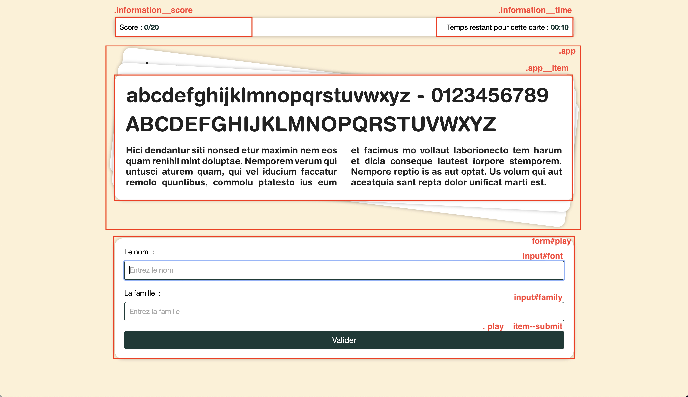
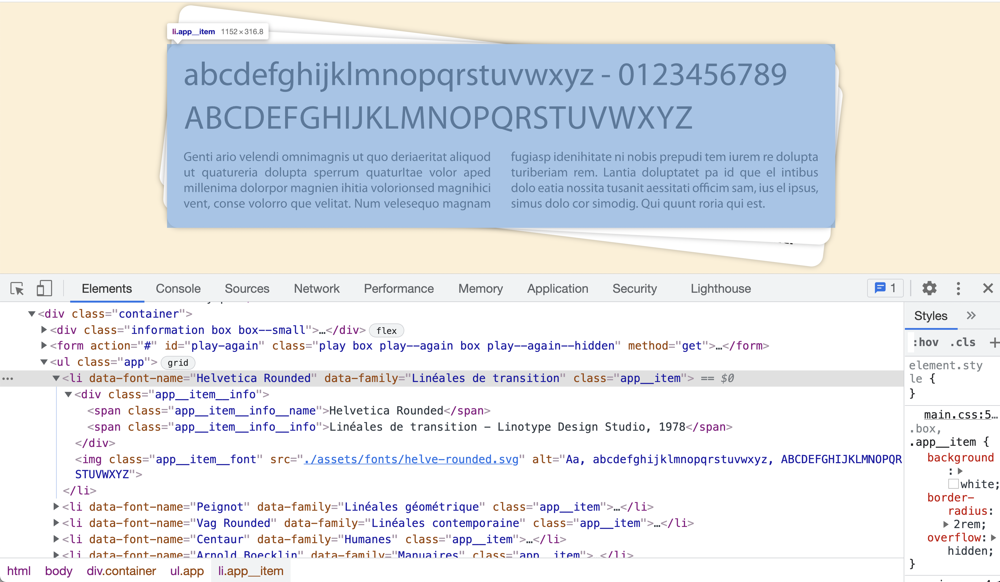
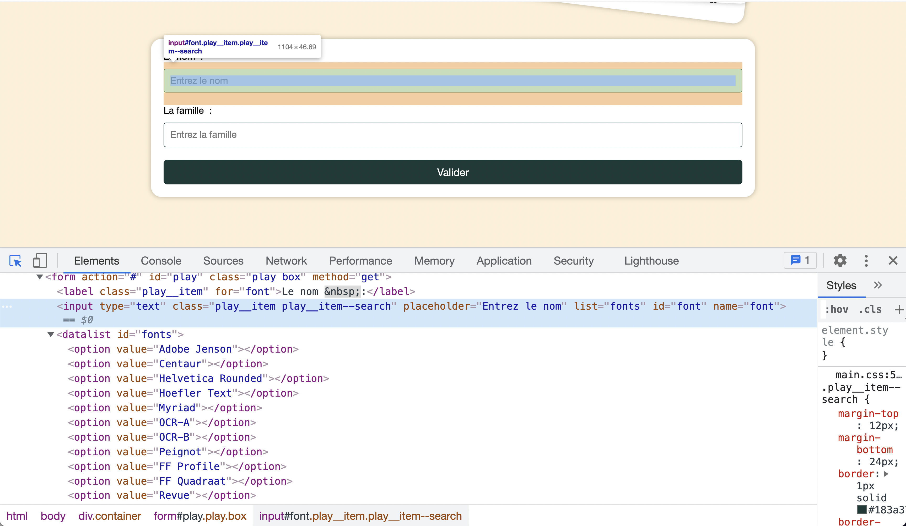

# Tymper ❤️

> Examen DCC janvier 2022


## Préambule

1. Dans le cadre de cet examen de *Développement Côté Client* vous devez uniquement vous focaliser sur le fichier `main.js`, qui se trouve à la racine. Mis à part ajouter la balise `script`, on ne vous demande pas de modifier le code HTML ni le code CSS qui s'y rapporte;
1. Cet examen dure maximum 4 heures;
1. Vous êtes obligé d'enregistrer  l’entièreté de tous vos écrans ainsi qu'une caméra frontale de vous;
1. Vous devez également produire des commits et pusher toutes les 30 minutes maximum;
1. Bien sûr, votre présence sur Teams est requise.

## Identification des éléments d’interface

Dans la capture d’écrans ci-dessous, vous pouvez voir l’application avec ses noms de classes, correspondant aux différents éléments que vous devez manipuler.




## Les fonctionnalités

### Démarrer le jeu

#### Produire les cartes

La première étape consiste à produire par JavaScript l'ensemble des fiches à deviner. Pour ce faire, vous devez vous servir de la variable globale `fonts`. Celle-ci contient une collection d'objets représentant chacun une police de caractères différente. À partir du nom de la police, vous pouvez produire une fiche qui se matérialise par un item qu'il faut ajouter à la liste `.app`. 

```html
<li data-font-name="nom" data-family="famille" class='app__item'>
  <div class="app__item__info"><span class="app__item__info__name">nom</span>
    <span class="app__item__info__info">famille - auteur</span>
  </div>
  
</li>
```

Vous devez mettre à jour :

* `nom` par le nom de la police de caractères; (3 fois dans ce bloc)
* `famille` par la famille de la police de caractères; (2 fois dans ce bloc)
* `auteur` par l'auteur de la police de caractères; (1 fois dans ce bloc)



#### Enrichir le formulaire

Afin d'augmenter le confort d’utilisation, nous vous demandons de peupler la  `datalist#fonts` avec les valeurs possibles, à savoir les noms des polices de caractères. Vous devez vous servir de la même variable globale `fonts`.





#### Afficher les informations du jeu

Dans l’élément `p.information__score` vous devez récupérer la valeur de l'attribut `data-text` et le concaténer avec le nombre de bonnes cartes jouées sur le nombre total de cartes et en faire le contenu texte de l’élément. Ainsi au début du jeu vous obtenez ceci :

```html
<p class="information__score" data-text="Score&nbsp;: ">
  Score&nbsp;:  <span>0/100</span>
</p>
```

Ces nombres sont dynamiques. Le score évoluera au fil des coups joués par l’utilisateur, tandis que le total correspond au nombre d'objets disponibles dans la variable globale `fonts`.

Dans l’élément, `p.information__time` vous devez récupérer la valeur de l'attribut `data-text` et le concaténer au temps restant. À savoir 10 secondes par cartes. Il s'agit d'un paramètre du jeu.

Ainsi au début du jeu vous obtenez ceci :

```html
<p class="information__time" data-text="Temps restant pour cette carte&nbsp;: ">
  Temps restant pour cette carte&nbsp;:  <time datetime="00:10">00:10</time>
</p>
```


### Jouer

Dès lors que l'utilisateur soumet les informations du formulaire `form#play`, vous devez 

* Vérifier si le nom renseigné à partir du champ `input#font` ainsi que la famille renseignée à partir du champ `input#family` correspondent à la fiche que vous lui présentez, à savoir le dernier item de la liste `ul.app`.
  * Si les deux informations sont exactes, vous attribuez un point;
  * Si l'une des deux informations est exacte, vous attribuez un demi-point;
  * Si les deux informations sont fausses, vous n'attribuez aucun point;
* Si l’utilisateur renseigne correctement les deux informations, vous devez ajouter à la fiche en cours deux classes : `app__item--move` et  `app__item--move--success`. 
* Dans tous les autres cas, vous devez ajouter les deux classes : `app__item--move` et `app__item--move--error`
* L'ajout de ces classes provoque une transition CSS. Si l’utilisateur a soumis une mauvaise réponse, vous devez en plus _cloner_ la fiche courante dans la liste, `wrong-cards` mais uniquement quand la transition s’est terminée, et sans les 2 classes que vous venez d'ajouter.
* Vous devez, en fonction du coup qui vient d'être joué, calculer le score et l’afficher.
* Vous devez mettre en place un compteur à rebours qui s'enclenche automatiquement au chargement de la page. 
  * Quand l'utilisateur soumet une réponse, le compteur doit être réinitialisé. 
  *  Quand le compteur arrive à 0, la carte passe dans la liste des cartes non résolues avec sa transition. Comme si l’utilisateur avait mal répondu.
* Quand l'utilisateur a joué la dernière fiche, alors il faut faire apparaitre le formulaire `form#play-again` en retirant sa classe `play--again--hidden`. 
* Quand l'utilisateur soumet ce formulaire `form#play-again`, il faut régénérer le jeu et cacher le formulaire en ajoutant la classe `play--again--hidden`.

Vous pouvez regarder [la vidéo readme.m4v](./readme.m4v) au besoin.

https://user-images.githubusercontent.com/8074967/147498344-dd39e7c2-9d3f-4d0c-bac5-030f12022f29.mov

## Améliorations 

1. Avant de générer les fiches, mélangez-les. Il suffit de permuter chaque objet du tableau avec un autre élément déterminé à partir d'un indice aléatoire compris entre 0 et la taille du tableau -1.

2. Éviter qu'on puisse soumettre le formulaire de réponse durant la transition CSS.

   
